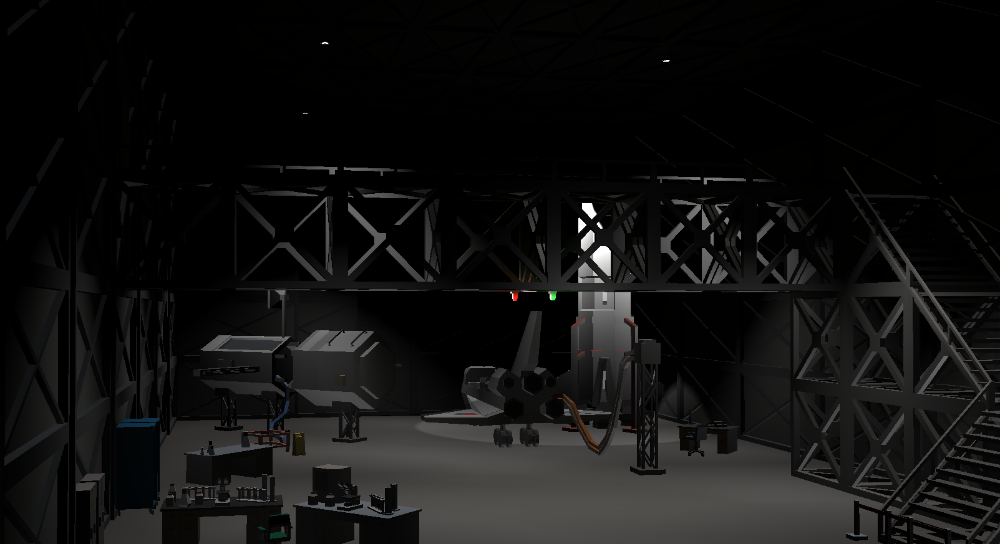

# Space hangar exam

## About

Exam for "Graphics" class. A space hangar scenario.

## Requirements

- Visual studio 2022

## How to run

1. Unzip all libs from the .zip file in the "extern/lib/" folder
2. Open the solution in VS
3. Build first the "Engine" project, then run the startup project
4. If using the .exe generated remember that it should be at the same folder as the "assets" and "configs" folder
5. Press P to start playing and C to open and close the doors.

## Questions answered

1. Build the blocks using the "tiles" components, that will draw the model XYZ times depending on the parameters
    - The bonus was achieved with 6 spot lights placed under the model lights with a dim ilumination
    - A dim directional light was placed to give a little more of ilumination
    - The right corner light is with a more hard angle for the spot light inner and outer angles
2. The walkway was also constructed usind the tile component, the red and green lights place right under it in the middle using point lights, and the walkway door was place at the left wall
3. Al the 10 props were set: Plants on the left wall, server on the left wall, telephone and tubes on the right table, troller on the side of the satellite, sign in front of the troller, a chair for the corner table, a chair for the right table, tapes in front of the stairs and a locker on the left wall
4. The door opens when press C on playing mode, and the lights will also change brightness, the "player" component sends the action to the mediator that will start their respective animations, the animations will make the calculations and send the action to the mediator to update the right components
    - The bonus was achieved using the "trigger" function from the animation component, that when the animation reaches a certain value it will trigger other animation, in this case the other doors
    - The lights were placed at the -600 z and can bee seen when the doors open in the sky, I setted only above a certain high to make more realistic and don't have stars close to the ground

## How to use

- To alternate between play mode or editor mode press P
- To open and shut the doors press C
- To change any model, light or camera location you can just change the parameters on the "database" files
- To change in the scene you can also use these controls:
  - Close Window: GLFW_KEY_ESCAPE - Close the window when the GLFW_KEY_ESCAPE key is pressed.
  - Save Scene: GLFW_KEY_F1 - Save the scene when the GLFW_KEY_F1 key is pressed.
  - Reload Scene: GLFW_KEY_F5 - Reload the scene when the GLFW_KEY_F5 key is pressed.

  - CTRL key down + action key (Light controls):
    - Page Up (GLFW_KEY_PAGE_UP) and Page Down (GLFW_KEY_PAGE_DOWN) - Change the selected light.
    - A (GLFW_KEY_A) and D (GLFW_KEY_D) - Move the selected light in the X direction.
    - Q (GLFW_KEY_Q) and E (GLFW_KEY_E) - Move the selected light in the Y direction.
    - S (GLFW_KEY_S) and W (GLFW_KEY_W) - Move the selected light in the Z direction.
    - Z (GLFW_KEY_Z) and X (GLFW_KEY_X) - Change the linear attenuation of the selected light.
    - C (GLFW_KEY_C) and V (GLFW_KEY_V) - Change the quadratic attenuation of the selected light.
    - F (GLFW_KEY_F) and H (GLFW_KEY_H) - Change the direction of the selected light in the X-axis.
    - R (GLFW_KEY_R) and Y (GLFW_KEY_Y) - Change the direction of the selected light in the Y-axis.
    - G (GLFW_KEY_G) and T (GLFW_KEY_T) - Change the direction of the selected light in the Z-axis.
    - J (GLFW_KEY_J) and L (GLFW_KEY_L) - Change parameter 0 of the selected light.
    - U (GLFW_KEY_U) and O (GLFW_KEY_O) - Change parameter 1 of the selected light.
    - K (GLFW_KEY_K) and I (GLFW_KEY_I) - Change parameter 2 of the selected light.
    - B (GLFW_KEY_B) - Toggle the selected light.

  - SHIFT key down + action key (Mesh controls): Similar to light controls, but these actions apply to the selected mesh instead of the light.

  - No modifier key down (Camera controls):
    - A (GLFW_KEY_A) and D (GLFW_KEY_D) - Move the camera in the X direction.
    - Q (GLFW_KEY_Q) and E (GLFW_KEY_E) - Move the camera in the Y direction.
    - S (GLFW_KEY_S) and W (GLFW_KEY_W) - Move the camera in the Z direction.
    - Z (GLFW_KEY_Z) and X (GLFW_KEY_X) - Change the camera target in the X direction.
    - C (GLFW_KEY_C) and V (GLFW_KEY_V) - Change the camera target in the Y direction.

### Screenshots

